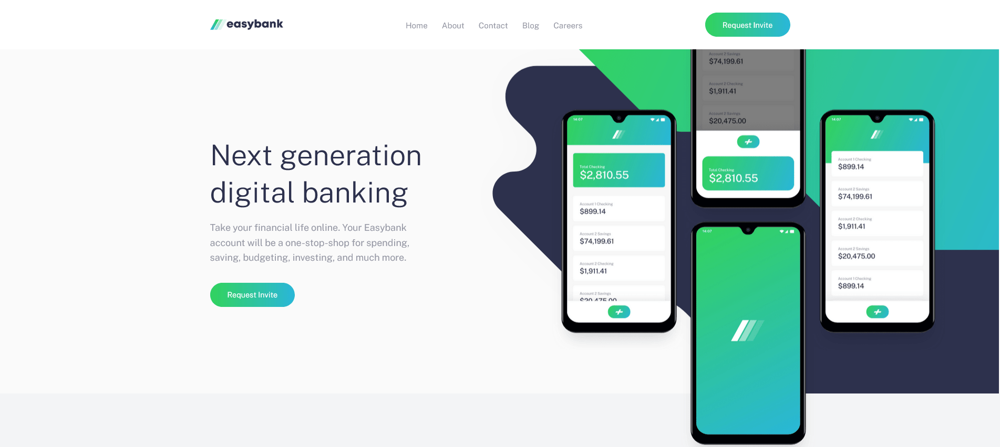

# Frontend Mentor - Easybank landing page solution

This is a solution to the [Easybank landing page challenge on Frontend Mentor](https://www.frontendmentor.io/challenges/easybank-landing-page-WaUhkoDN). Frontend Mentor challenges help you improve your coding skills by building realistic projects.

## Table of contents 📑

- [Overview](#overview)
  - [The challenge](#the-challenge)
  - [Screenshot](#screenshot)
  - [Links](#links)
- [My process](#my-process)
  - [Built with](#built-with)
  - [What I learned](#what-i-learned)
  - [Continued development](#continued-development)
  - [Useful resources](#useful-resources)
- [Author](#author)

## Overview

### The challenge 👍

Users should be able to:

- View the optimal layout for the site depending on their device's screen size
- See hover states for all interactive elements on the page

### Screenshot 📷

Mobile Design


Desktop Design



### Links 🔗

[](https://app.netlify.com/sites/dylangangat-easybank-webisite/deploys)

- Live Site URL: [Easybank landing page](https://dylangangat-easybank-landing-page.netlify.app/)

## My process

### Built with 🏗️

- Semantic HTML5 markup
- CSS custom properties
- Scss
- Flexbox
- CSS Grid
- Mobile-first workflow
- JavaScript

### What I learned 🧠

This project was a bit more complex compared to my previous Front-end Mentor Challenge but I was determined to complete it and learnt a few things on the way.

- I learnt how to make a responsive navigation that switches into a toggle menu. This really tested my critical thinking and planning skills. On how to set up the html.

- One of the most difficult parts of the project was figuring how to make the hero section responsive and on the way I learnt a lot more about positioning elements with background properties and stacking context.

- I also spent a bit of time on trying to add a simple animation to the toggle menu. I learnt a valuable lesson that animations don't work with `display: none;`

- Spent a bit of time praticing my DOM manipulation skills by making the navigation toggle and changing it's button on a click event.

### Favorite selector from this project 🥇

This was my favorite selector due to me exploiting the power it has to make items responsive with only one line of code which I think is amazing!

```css
grid-template-columns: repeat(auto-fit, minmax(15rem, 1fr));
```

## Author

Frontend Mentor - [@DylanGangat](https://www.frontendmentor.io/profile/DylanGangat) 😊
